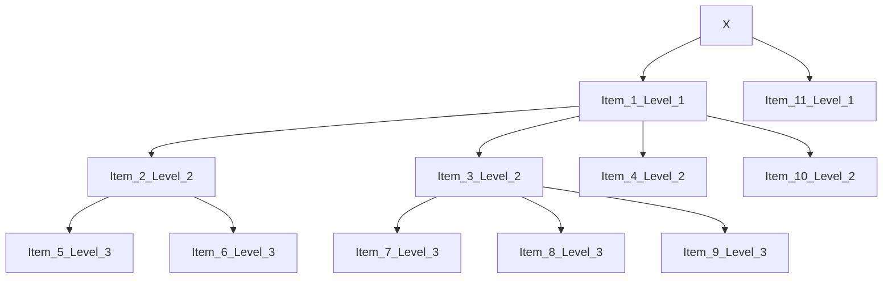

# Excel2XML
### <b>Excel2XML</b> is a powerful and user-friendly tool designed to convert XML files to Excel and vice versa. This tool is particularly useful for Archicad users, allowing seamless integration with the Classification Manager.

## Features
Convert XML to Excel: Easily transform XML data into an organized Excel file.
Convert Excel to XML: Generate XML files from structured Excel data, suitable for use in Archicad's Classification Manager.
User-Friendly Interface: Intuitive and easy to navigate.
## Requirements
Python 3.12 or higher
Libraries: tkinter, pandas, lxml
## Installation
Extract the Zip File: Download and extract the provided zip file.
Navigate to the Directory: Open your terminal or command prompt and navigate to the extracted folder.
## Usage
### 1. Run the Application:

    python template_v01.py

### 2. Using the Interface:
<ul>
  <li>Convert XML to Excel: Click the "Convert XML to Excel" button and select your XML file.</li>
  <li>Convert Excel to XML: Click the "Convert Excel to XML" button and select your Excel file. Ensure the Excel file contains the following columns in the first row: ID, Name, Description, Level (with Level being 1, 2, 3, ...).</li>
</ul>

## Sample Data
The Excel file must contain the following columns in the first row:

<ul>
  <li><b>`ID`</b></li>
<li><b>`Name`</b></li>
<li><b>`Description`</b></li>
<li><b>`Level`</b></li>
</ul>

Example:
<table>
  <tr>
    <th>ID</th>
    <th>Name</th>
    <th>Description</th>
    <th>Level</th>
  </tr>
  <tr>
    <td>1</td>
    <td>Item1</td>
    <td>Description1</td>
    <td>1</td>
  </tr>
  <tr>
    <td>2</td>
    <td>Item2</td>
    <td>Description2</td>
    <td>2</td>
  </tr>
  <tr>
    <td>3</td>
    <td>Item3</td>
    <td>Description3</td>
    <td>2</td>
  </tr>
  <tr>
    <td>4</td>
    <td>Item4</td>
    <td>Description4</td>
    <td>2</td>
  </tr>
  <tr>
    <td>5</td>
    <td>Item5</td>
    <td>Description5</td>
    <td>3</td>
  </tr>
  <tr>
    <td>6</td>
    <td>Item6</td>
    <td>Description6</td>
    <td>3</td>
  </tr>
  <tr>
    <td>7</td>
    <td>Item7</td>
    <td>Description7</td>
    <td>3</td>
  </tr>
  <tr>
    <td>8</td>
    <td>Item8</td>
    <td>Description8</td>
    <td>3</td>
  </tr>
  <tr>
    <td>9</td>
    <td>Item9</td>
    <td>Description9</td>
    <td>3</td>
  </tr>
      <tr>
    <td>10</td>
    <td>Item10</td>
    <td>Description10</td>
    <td>2</td>
  </tr>
    <tr>
    <td>11</td>
    <td>Item11</td>
    <td>Description11</td>
    <td>1</td>
  </tr>
</table>

Here is a simple flow chart:

## Screenshots

### Main Page

### Convert EXCEL TO XML

### Convert XML TO EXCEL

## Contribution
### We welcome contributions to improve the functionality and usability of this tool. Please fork the repository and submit your pull requests.

## License
#### This project is licensed under the MIT License.

## Contact
###For any queries or feedback, please contact me at:

#### <b>Email:</b> khaledsfax03@gmail.com
#### <b>LinkedIn:/b> linkedin.com/in/khaledkammoun
#### <b>GitHub:/b> github.com/KhaledKammoun

# COPYRIGHT

EXCEL2XML is released into the public domain by the copyright holders.

This README file was originally written by [Khaled Kammoun](https://github.com/KhaledKammoun) and is likewise released into the public domain.
